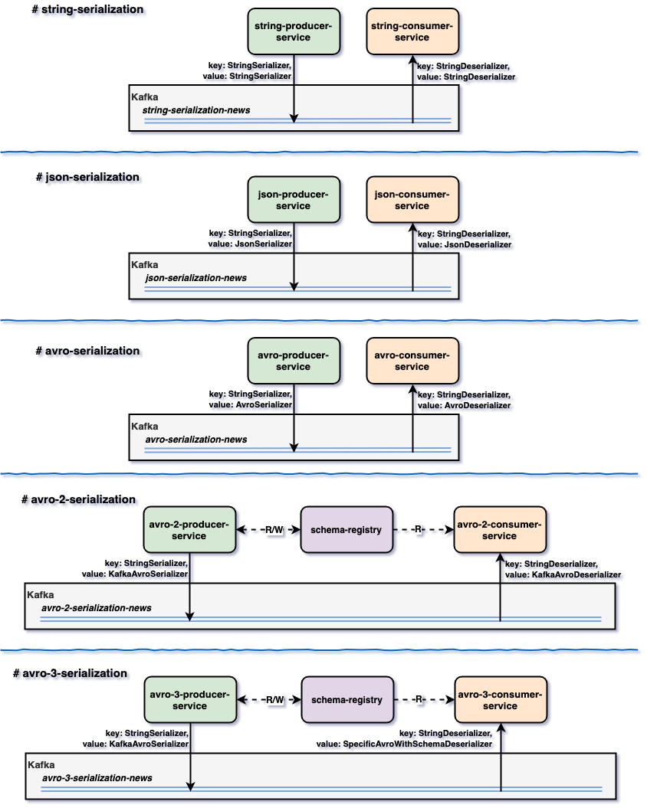

# springboot-spring-kafka

The goal of this project is to play with [`Spring Kafka`](https://docs.spring.io/spring-kafka/reference/htmlsingle/). We've implemented 5 examples of `producer` and `consumer` services that exchanges messages through [`Kafka`](https://kafka.apache.org/) using different types of serialization and approaches.

## Start Environment

- Open a terminal and inside `springboot-spring-kafka` root folder run
  ```
  docker-compose up -d
  ```

- Wait a little bit until all containers are `Up (healthy)`. To check the status of the containers run
  ```
  docker-compose ps
  ```

## Examples

The following examples demonstrate a **producer** that pushes _"News"_ messages to a topic in `Kafka` and a **consumer** that listens those messages from `Kafka`.



- ### [string-serialization](https://github.com/ivangfr/springboot-spring-kafka/tree/master/string-serialization#springboot-spring-kafka)
- ### [json-serialization](https://github.com/ivangfr/springboot-spring-kafka/tree/master/json-serialization#springboot-spring-kafka)
- ### [avro-serialization](https://github.com/ivangfr/springboot-spring-kafka/tree/master/avro-serialization#springboot-spring-kafka)
- ### [avro-2-serialization](https://github.com/ivangfr/springboot-spring-kafka/tree/master/avro-2-serialization#springboot-spring-kafka)
- ### [avro-3-serialization](https://github.com/ivangfr/springboot-spring-kafka/tree/master/avro-3-serialization#springboot-spring-kafka)

## Shutdown

- In a terminal, make sure you are in `springboot-spring-kafka` root folder

- To stop and remove docker-compose containers, networks and volumes
  ```
  docker-compose down -v
  ```

## Useful Links

- **Schema Registry UI**

  `Schema Registry UI` can be accessed at http://localhost:8001

- **Kafka Topics UI**

  `Kafka Topics UI` can be accessed at http://localhost:8085

- **Kafka Manager**

  `Kafka Manager` can be accessed at http://localhost:9000

  _Configuration_
  - First, you must create a new cluster. Click on `Cluster` (dropdown on the header) and then on `Add Cluster`
  - Type the name of your cluster in `Cluster Name` field, for example: `MyZooCluster`
  - Type `zookeeper:2181`in `Cluster Zookeeper Hosts` field
  - Enable checkbox `Poll consumer information (Not recommended for large # of consumers if ZK is used for offsets tracking on older Kafka versions)`
  - Click on `Save` button at the bottom of the page.

## References

- https://codenotfound.com/spring-kafka-consumer-producer-example.html
- https://codenotfound.com/spring-kafka-json-serializer-deserializer-example.html
- https://codenotfound.com/spring-kafka-apache-avro-serializer-deserializer-example.html