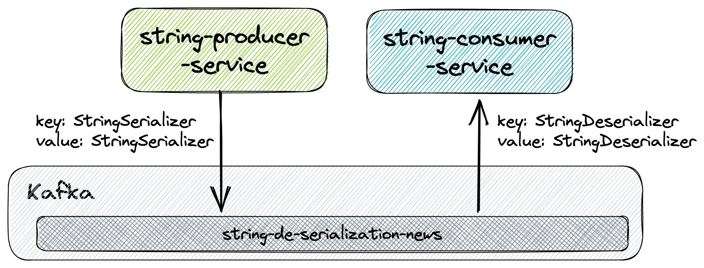
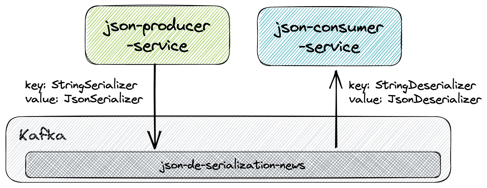
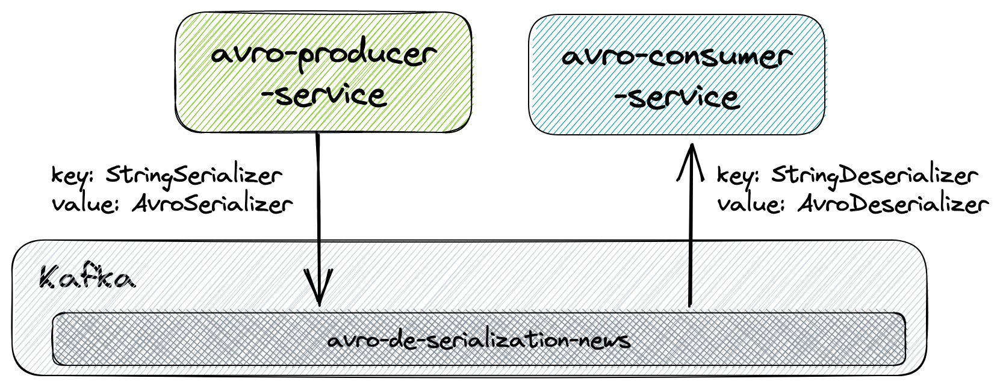
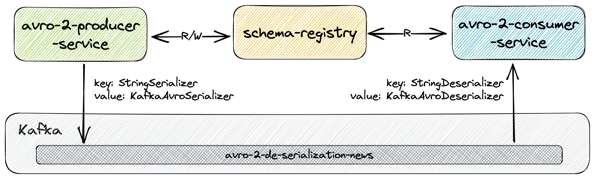

# spring-kafka-de-serialization-types

The goal of this project is to play with [`Spring for Apache Kafka`](https://docs.spring.io/spring-kafka/reference/index.html). We've implemented 5 examples of `producer` and `consumer` services that exchange messages through [`Apache Kafka`](https://kafka.apache.org/) using different types of serialization and approaches.

## Proof-of-Concepts & Articles

On [ivangfr.github.io](https://ivangfr.github.io), I have compiled my Proof-of-Concepts (PoCs) and articles. You can easily search for the technology you are interested in by using the filter. Who knows, perhaps I have already implemented a PoC or written an article about what you are looking for.

## Examples

The following examples demonstrate a **producer** that pushes _"News"_ messages to a topic in `Kafka` and a **consumer** that listens to those messages from `Kafka`.

| Example                                                                                                                                                            | Diagram                                                                |
|--------------------------------------------------------------------------------------------------------------------------------------------------------------------|------------------------------------------------------------------------|
| [string-de-serialization](https://github.com/ivangfr/spring-kafka-de-serialization-types/tree/master/string-de-serialization#spring-kafka-de-serialization-types)  |  |
| [json-de-serialization](https://github.com/ivangfr/spring-kafka-de-serialization-types/tree/master/json-de-serialization#spring-kafka-de-serialization-types)      |    |
| [avro-de-serialization](https://github.com/ivangfr/spring-kafka-de-serialization-types/tree/master/avro-de-serialization#spring-kafka-de-serialization-types)      |    |
| [avro-2-de-serialization](https://github.com/ivangfr/spring-kafka-de-serialization-types/tree/master/avro-2-de-serialization#spring-kafka-de-serialization-types)  |  |
| [avro-3-de-serialization](https://github.com/ivangfr/spring-kafka-de-serialization-types/tree/master/avro-3-de-serialization#spring-kafka-de-serialization-types)  |  |

## Prerequisites

- [`Java 21`](https://www.oracle.com/java/technologies/downloads/#java21) or higher.
- A containerization tool (e.g., [`Docker`](https://www.docker.com), [`Podman`](https://podman.io), etc.)

## Start Environment

- Open a terminal and inside the `spring-kafka-de-serialization-types` root folder run:
  ```bash
  docker compose up -d
  ```

- Wait for Docker containers to be up and running. To check it, run:
  ```bash
  docker ps -a
  ```

## Useful Links

- **Schema Registry UI**

  `Schema Registry UI` can be accessed at http://localhost:8001

- **Kafka Topics UI**

  `Kafka Topics UI` can be accessed at http://localhost:8085

- **Kafka Manager**

  `Kafka Manager` can be accessed at http://localhost:9000

  _Configuration_
  - First, you must create a new cluster. Click on `Cluster` (dropdown on the header) and then on `Add Cluster`.
  - Type the name of your cluster in `Cluster Name` field, for example: `MyCluster`.
  - Type `zookeeper:2181` in `Cluster Zookeeper Hosts` field.
  - Enable checkbox `Poll consumer information (Not recommended for large # of consumers if ZK is used for offsets tracking on older Kafka versions)`.
  - Click on `Save` button at the bottom of the page.

## Shutdown

To stop and remove docker compose containers, network and volumes, go to a terminal and, inside the `spring-kafka-de-serialization-types` root folder, run the command below:
```bash
docker compose down -v
```

## Cleanup

To remove the Docker images created by this project, go to a terminal and, inside the `spring-kafka-de-serialization-types` root folder, run the following script:
```bash
./remove-docker-images.sh all
```

## References

- https://codenotfound.com/spring-kafka-consumer-producer-example.html
- https://codenotfound.com/spring-kafka-json-serializer-deserializer-example.html
- https://codenotfound.com/spring-kafka-apache-avro-serializer-deserializer-example.html