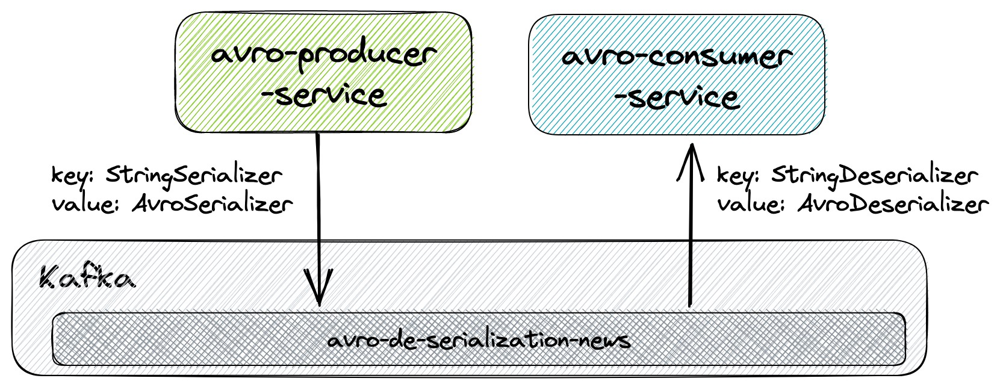

# spring-kafka-de-serialization-types
## `> avro-de-serialization`



This sample demonstrates a **producer** that pushes `News` messages to a topic in `Kafka` and a **consumer** that listens those messages from `Kafka`:
- **Producer** serializes the message `key` using `StringSerializer` and the message `value` using `AvroSerializer`;
- **Consumer** deserializes the message `key` using `StringDeserializer` and the message `value` using `AvroDeserializer`;
- We needed to implement `AvroSerializer` and `AvroDeserializer` classes;
- **Producer** creates the Kafka topics and **Consumer** doesn't.

## Start Environment

Before starting producer and consumer, the services present in `docker-compose.yml` file must be up and running as explained in [Start Environment](https://github.com/ivangfr/spring-kafka-de-serialization-types#start-environment) section of the main README.

## Running applications using Maven

> **Note**: run `avro-producer-service` first so that it can create the `Kafka` topics.

- **avro-producer-service**

  - Open a terminal and navigate to `spring-kafka-de-serialization-types` root folder;
  - Run application:
    ```
    ./mvnw clean spring-boot:run --projects avro-de-serialization/avro-producer-service
    ```
    > The Java class `com.ivanfranchin.avroproducerservice.avro.NewsMessage` is generated by the Avro file `news-message.avsc` present in `src/main/resources/avro` by running the command:
    > ```
    > ./mvnw generate-sources --projects avro-de-serialization/avro-producer-service
    > ```
  - As soon as the producer is up and running, it will start pushing automatically and randomly `News` messages to `Kafka` topic `avro-de-serialization-news`. The default `interval` between messages is `3 seconds`.

- **avro-consumer-service**

  - Open another terminal and make sure you are in `spring-kafka-de-serialization-types` root folder;
  - Run application:
    ```
    ./mvnw clean spring-boot:run --projects avro-de-serialization/avro-consumer-service
    ```
    > The Java class `com.ivanfranchin.avroconsumerservice.avro.NewsMessage` is generated by the Avro file `news-message.avsc` present in `src/main/resources/avro` by running the command:
    > ```
    > ./mvnw generate-sources --projects avro-de-serialization/avro-consumer-service
    > ```
  - Once the consumer is up and running, it will start listening `News` messages from the `Kafka` topic `avro-de-serialization-news`.

## Running applications as Docker containers

- ### Build Docker images

  In a terminal and, inside `spring-kafka-de-serialization-types` root folder, run:
  ```
  ./docker-build.sh avro-de-serialization
  ```

- ### Environment variables

  **avro-producer-service** and **avro-consumer-service**

  | Environment Variable | Description                                                             |
  |----------------------|-------------------------------------------------------------------------|
  | `KAFKA_HOST`         | Specify host of the `Kafka` message broker to use (default `localhost`) |
  | `KAFKA_PORT`         | Specify port of the `Kafka` message broker to use (default `29092`)     |

- ### Run Docker containers

  > **Note**: run `avro-producer-service` first so that it can create the `Kafka` topics.

  - **avro-producer-service**

    In a terminal, run the following Docker command:
    ```
    docker run --rm --name avro-producer-service -p 9084:9084 \
      -e KAFKA_HOST=kafka -e KAFKA_PORT=9092 \
      --network=spring-kafka-de-serialization-types_default \
      ivanfranchin/avro-producer-service:1.0.0
    ```

  - **avro-consumer-service**

    In another terminal, run the Docker command below:
    ```
    docker run --rm --name avro-consumer-service -p 9085:9085 \
      -e KAFKA_HOST=kafka -e KAFKA_PORT=9092 \
      --network=spring-kafka-de-serialization-types_default \
      ivanfranchin/avro-consumer-service:1.0.0
    ```
  
## Shutdown

- Go to the terminals where the applications are running and press `Ctrl+C`;
- Stop the services present in `docker-compose.yml` as explained in [Shutdown](https://github.com/ivangfr/spring-kafka-de-serialization-types#shutdown) section of the main README.

## Cleanup

To remove the Docker images created by this example, go to a terminal and, inside `spring-kafka-de-serialization-types` root folder, run the following script.
```
./remove-docker-images.sh avro-de-serialization
```
